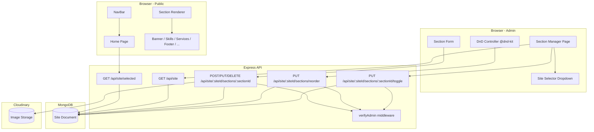

# Design Document — Dynamic CMS Sections

## Overview

This feature refactors the portfolio CMS from a flat, hardcoded `Site` document into a dynamic, section-based content model. The core change is replacing fixed fields (`hero`, `heroTitle`, `skillsTitle`, etc.) with a `sections` subdocument array, where each entry is an independently managed content block.

The work spans three layers:

1. **Backend** — Mongoose schema update + new section CRUD/reorder/toggle REST endpoints nested under `/api/site/:siteId/sections`.
2. **Admin UI** — A new Section Manager page that lists, creates, edits, deletes, reorders (drag-and-drop), and toggles sections for any site.
3. **Public homepage** — A dynamic Section Renderer that reads the selected site's sections and routes each one to the correct existing React component (`Banner`, `Skills`, `Services`, `Footer`, etc.) based on the section's `key`.

Global site-level fields (`siteName`, `logoheader`, `contactEmail`, `selected`, `roles`, `linkedIn`, `facebook`, `instagram`) are preserved unchanged. All existing site management endpoints remain backward-compatible.

---

## Architecture



**Key design decisions:**

- Section endpoints are nested under `/api/site/:siteId/sections` to make the parent-child relationship explicit and avoid route collisions with the existing flat `/api/site` routes.
- The `PUT /api/site/:siteId/sections/reorder` route is registered **before** `PUT /api/site/:siteId/sections/:sectionId` in Express to prevent `"reorder"` being matched as a `sectionId` parameter.
- The `selected` field is migrated from a string enum (`"selected"` / `"not selected"`) to a proper `Boolean` with `default: false`. The select/deselect endpoints are updated to use `await Site.updateMany({}, { selected: false })` then set the target to `true`.
- Cloudinary image upload for sections reuses the existing `multer-storage-cloudinary` configuration already present in `routes/contentsite.js`.

---

## Components and Interfaces

### Backend

#### `SectionSchema` (Mongoose subdocument)

Embedded inside `SiteSchema` as `sections: [SectionSchema]`.

| Field | Type | Constraints |
|---|---|---|
| `key` | String | required, enum: `["hero","skills","services","footer","about","projects"]` |
| `title` | String | optional |
| `subtitle` | String | optional |
| `content` | String | optional |
| `image` | String | optional (Cloudinary URL) |
| `order` | Number | required |
| `visible` | Boolean | default `true` |

#### Updated `SiteSchema` global fields (retained)

| Field | Type | Notes |
|---|---|---|
| `siteName` | String | unchanged |
| `logoheader` | String | required, Cloudinary URL |
| `contactEmail` | String | required |
| `selected` | Boolean | **changed from String enum to Boolean**, default `false` |
| `roles` | [String] | default `[]` |
| `linkedIn` | String | default `''` |
| `facebook` | String | default `''` |
| `instagram` | String | default `''` |

Fields removed: `siteDescription`, `hero`, `heroTitle`, `heroName`, `skillsTitle`, `serviceDescription`, `footer`, `logohero`.

#### New route file: `routes/sections.js`

Mounted in `server.js` as:
```js
app.use("/api/site", routerSections); // handles /api/site/:siteId/sections/*
```

| Method | Path | Auth | Description |
|---|---|---|---|
| `POST` | `/api/site/:siteId/sections` | verifyAdmin | Add section (with optional image upload) |
| `PUT` | `/api/site/:siteId/sections/reorder` | verifyAdmin | Bulk reorder by ID array |
| `PUT` | `/api/site/:siteId/sections/:sectionId` | verifyAdmin | Update section fields |
| `PUT` | `/api/site/:siteId/sections/:sectionId/toggle` | verifyAdmin | Toggle `visible` |
| `DELETE` | `/api/site/:siteId/sections/:sectionId` | verifyAdmin | Remove section |

#### Updated `routes/contentsite.js`

- `POST /api/site` — removes `logohero` upload requirement; only `logoheader` is required. Removes all deprecated fields from body parsing. Updates `selected` handling to Boolean.
- `PUT /api/site/:id` — same field cleanup.
- `PUT /api/site/:id/select` — uses `updateMany({}, { selected: false })` then sets `selected: true`.
- `PUT /api/site/:id/deselect` — sets `selected: false`.
- `GET /api/site/selected` — queries `Site.findOne({ selected: true })`, sorts `sections` by `order` ascending before returning.

### Frontend

#### New page: `frontend/src/pages/sectionsadmin.jsx`

The Section Manager page, accessible at `/admin/ManageSections`. Composed of:

- **`SiteSelector`** — dropdown populated from `GET /api/site`. Defaults to the currently selected site on mount.
- **`SectionList`** — renders sections for the chosen site using `@dnd-kit/sortable`. Each row shows key, title, order, visible badge, and action buttons (Edit, Delete, Toggle).
- **`SectionForm`** — controlled form for create/edit. Fields: `key` (select dropdown), `title`, `subtitle`, `content`, `order`, image upload with preview.

#### Updated `frontend/src/pages/home.jsx`

The `Home` component is refactored to use a `SectionRenderer` helper that:

1. Reads `siteContent.sections` (already sorted by the API).
2. Filters to `visible === true`.
3. Maps each section's `key` to the correct component using a static `SECTION_MAP`.
4. Passes the correct props to each component.

```js
const SECTION_MAP = {
  hero:     (section, site) => <Banner heroTitle={section.title} heroName={section.subtitle} hero={section.content} logohero={section.image} roles={site.roles} />,
  skills:   (section)       => <Skills skillsTitle={section.title} />,
  services: (section)       => <Services serviceDescription={section.content} />,
  footer:   (section)       => <Footer footer={section.content} />,
  about:    (section)       => <About section={section} />,
  projects: ()              => <Projects />,
};
```

`NavBar` continues to receive global fields directly from `siteContent` (not from sections).

#### Updated `frontend/src/components/sidebaradmin.jsx`

Adds a "Sections" navigation entry pointing to `/admin/ManageSections`.

#### Updated `frontend/src/pages/sitecontent.jsx`

Removes deprecated fields (`siteDescription`, `hero`, `heroTitle`, `heroName`, `skillsTitle`, `serviceDescription`, `footer`, `logohero`) from the form. Updates `selected` handling to Boolean. Removes `logohero` upload field.

---

## Data Models

### Site Document (MongoDB)

```json
{
  "_id": "ObjectId",
  "siteName": "My Portfolio",
  "logoheader": "https://res.cloudinary.com/.../logo.png",
  "contactEmail": "contact@example.com",
  "selected": true,
  "roles": ["Web Developer", "UI/UX Designer"],
  "linkedIn": "https://linkedin.com/in/...",
  "facebook": "https://facebook.com/...",
  "instagram": "https://instagram.com/...",
  "sections": [
    {
      "_id": "ObjectId",
      "key": "hero",
      "title": "Welcome to my Portfolio",
      "subtitle": "Ahmed Khmiri",
      "content": "I build modern web applications...",
      "image": "https://res.cloudinary.com/.../hero.png",
      "order": 0,
      "visible": true
    },
    {
      "_id": "ObjectId",
      "key": "skills",
      "title": "My Skills",
      "subtitle": null,
      "content": null,
      "image": null,
      "order": 1,
      "visible": true
    },
    {
      "_id": "ObjectId",
      "key": "footer",
      "title": null,
      "subtitle": null,
      "content": "© 2025 Ahmed Khmiri. All rights reserved.",
      "image": null,
      "order": 5,
      "visible": true
    }
  ]
}
```

### API Request/Response Shapes

**POST /api/site/:siteId/sections** (multipart/form-data)
```
key=hero
title=Welcome
subtitle=Ahmed
content=I build...
order=0          (optional — defaults to sections.length)
image=<file>     (optional)
```
Response: `201 { ...updatedSiteDocument }`

**PUT /api/site/:siteId/sections/reorder** (JSON)
```json
{ "sectionIds": ["id1", "id2", "id3"] }
```
Response: `200 { ...updatedSiteDocument }`

**PUT /api/site/:siteId/sections/:sectionId/toggle**
No body required.
Response: `200 { ...updatedSiteDocument }`

---

## Correctness Properties

*A property is a characteristic or behavior that should hold true across all valid executions of a system — essentially, a formal statement about what the system should do. Properties serve as the bridge between human-readable specifications and machine-verifiable correctness guarantees.*

### Property 1: Section addition appends with correct auto-order

*For any* site with N existing sections, when a new section is added via `POST /api/site/:siteId/sections` without an explicit `order` field, the returned site document SHALL contain N+1 sections and the new section SHALL have `order === N`.

**Validates: Requirements 1.5, 2.1**

---

### Property 2: Partial update preserves unmodified fields

*For any* existing section and any non-empty subset of its updatable fields (`key`, `title`, `subtitle`, `content`, `order`), a `PUT` request containing only that subset SHALL update exactly those fields and leave all other section fields unchanged.

**Validates: Requirements 2.2**

---

### Property 3: Delete removes exactly the targeted section

*For any* site with one or more sections, deleting a section by its ID SHALL result in the returned `sections` array not containing that section ID, while all other sections remain present and unchanged.

**Validates: Requirements 2.3**

---

### Property 4: Protected endpoints reject unauthenticated requests

*For any* section mutation endpoint (`POST`, `PUT`, `DELETE` on `/api/site/:siteId/sections/*`), a request made without a valid Admin JWT token SHALL receive HTTP 401, regardless of the request body or path parameters.

**Validates: Requirements 2.4, 3.4, 4.3**

---

### Property 5: Invalid section key is rejected

*For any* string value not in the allowed enum (`"hero"`, `"skills"`, `"services"`, `"footer"`, `"about"`, `"projects"`), a `POST` or `PUT` request to a section endpoint with that `key` value SHALL return HTTP 400.

**Validates: Requirements 2.8**

---

### Property 6: Reorder assigns positions matching array index

*For any* permutation of a site's section IDs, a `PUT /api/site/:siteId/sections/reorder` request with that permutation SHALL result in each section's `order` field equaling its 0-based index in the provided array.

**Validates: Requirements 3.1**

---

### Property 7: Visibility toggle inverts the current value

*For any* section with any `visible` value, calling the toggle endpoint SHALL invert `visible` (true → false, false → true). Calling toggle twice in succession SHALL restore the original `visible` value (round-trip property).

**Validates: Requirements 4.1**

---

### Property 8: GET /selected returns sections sorted ascending by order

*For any* selected site whose sections have `order` values in any arbitrary sequence, `GET /api/site/selected` SHALL return those sections sorted in strictly ascending order by the `order` field.

**Validates: Requirements 5.1**

---

### Property 9: Section Renderer displays only visible sections in order

*For any* array of sections with mixed `visible` values and arbitrary `order` values, the Section Renderer SHALL render only sections where `visible === true`, and SHALL render them in ascending `order` sequence.

**Validates: Requirements 9.1**

---

### Property 10: Section key maps to the correct component with correct props

*For any* section with a valid `key`, the Section Renderer SHALL render the component corresponding to that key, and SHALL pass the section's fields to that component using the correct prop mapping:
- `"hero"` → `Banner` with `heroTitle=section.title`, `heroName=section.subtitle`, `hero=section.content`, `logohero=section.image`
- `"skills"` → `Skills` with `skillsTitle=section.title`
- `"services"` → `Services` with `serviceDescription=section.content`
- `"footer"` → `Footer` with `footer=section.content`

**Validates: Requirements 9.2, 9.3, 9.4, 9.5, 9.6**

---

## Error Handling

### Backend

| Scenario | HTTP Status | Response Body |
|---|---|---|
| Missing/invalid JWT on protected route | 401 | `{ message: "No token provided" }` or `{ message: "Invalid token" }` |
| Non-admin user JWT | 403 | `{ message: "Access denied" }` |
| `siteId` not found | 404 | `{ message: "Site not found" }` |
| `sectionId` not found within site | 404 | `{ message: "Section not found" }` |
| Invalid `key` enum value | 400 | `{ message: "Validation error: key must be one of ..." }` |
| Reorder ID count mismatch | 400 | `{ message: "Section ID count mismatch" }` |
| Reorder contains unknown section ID | 400 | `{ message: "Unknown section ID: <id>" }` |
| Missing `logoheader` on site creation | 400 | `{ message: "logoheader is required" }` |
| Unexpected server error | 500 | `{ error: err.message }` |

All error responses use consistent JSON shape `{ message: string }` or `{ error: string }` to match the existing API convention.

### Frontend

- All API calls are wrapped in try/catch. Errors surface via `react-toastify` error toasts.
- On reorder failure, the Section Manager reverts the local section order to the pre-drag snapshot (stored in a `useRef` before the drag starts).
- On form submission failure, the form remains populated so the admin can correct and retry.
- During initial load, skeleton components (`BannerSkeleton`, `SkillsSkeleton`, `ProjectsSkeleton`) are shown until `siteContent` is non-null.
- If `GET /api/site/selected` fails, `siteContent` is set to `{}` to unblock rendering with graceful degradation (components receive `undefined` props and fall back to their defaults).

---

## Testing Strategy

### Unit Tests

Focus on specific examples, edge cases, and error conditions:

- Schema defaults: `visible` defaults to `true`, `selected` defaults to `false`.
- Auto-order assignment when `order` is omitted.
- `GET /api/site/selected` fallback when no site is selected.
- `GET /api/site/selected` returns `{}` when DB is empty.
- Reorder returns 400 when ID count mismatches.
- Reorder returns 400 when an unknown section ID is provided.
- Section form renders all required fields (key dropdown, title, subtitle, content, order, image upload).
- Section Manager shows "Hidden" badge for sections with `visible: false`.
- Section Renderer shows skeleton components during loading state.
- Section Renderer does not render a component when no section with that key exists.

### Property-Based Tests

Using **[fast-check](https://github.com/dubzzz/fast-check)** (JavaScript PBT library). Each test runs a minimum of **100 iterations**.

Tag format: `// Feature: dynamic-cms-sections, Property N: <property_text>`

| Property | What is generated | What is verified |
|---|---|---|
| P1: Section addition auto-order | Random site with 0–10 sections, random valid section data without `order` | New section has `order === sections.length` before insert |
| P2: Partial update preserves fields | Random section, random non-empty subset of fields to update | Updated fields match new values; untouched fields unchanged |
| P3: Delete removes targeted section | Random site with 1–5 sections, random target section | Target absent from result; all others present |
| P4: Auth rejection | Random valid request bodies for each protected endpoint | All return 401 without valid JWT |
| P5: Invalid key rejected | Random strings not in the enum | All return 400 |
| P6: Reorder assigns correct positions | Random permutation of section IDs | Each section's `order` equals its index in the permutation |
| P7: Toggle inverts visible | Random section with random `visible` value | Single toggle inverts; double toggle restores |
| P8: GET /selected sorts sections | Random sections with random `order` values | Returned sections are sorted ascending by `order` |
| P9: Renderer filters and sorts | Random sections with mixed `visible` and `order` | Only visible sections rendered, in ascending order |
| P10: Key-to-component prop mapping | Random section data for each valid key | Correct component rendered with correct props |

### Integration Tests

- `POST /api/site` and `PUT /api/site/:id` continue to work with the new schema (backward compatibility).
- `PUT /api/site/:id/select` and `/deselect` correctly update the Boolean `selected` field.
- Section image upload stores a Cloudinary URL in `section.image` (tested with mocked Cloudinary storage).
- `PUT /api/site/:sectionId` without a new image retains the existing `image` URL.

### Manual / Visual Tests

- Drag-and-drop reorder in the Section Manager works smoothly and persists on reload.
- Admin UI matches the violet/purple gradient theme (`linear-gradient(135deg, #AA367C, #4A2FBD)`).
- Hidden sections show reduced opacity or "Hidden" badge in the Section Manager list.
- Homepage reflects section changes immediately after saving in the admin.
